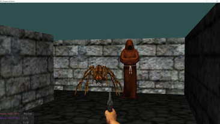

# Dungeon of Horrors

The aim of this project was to create a 3D retro shooter game using JavaFX library. Player has to fight enemies and escape the dungeon. Sprites were taken from: <https://www.spriters-resource.com/>.

## Dependencies

* JavaFX

Running the project can be a bit finicky. If you are using InteliJ go to File/Project Structure/Project Settings/Libraries/+/Java and locate the lib directory of javaFX library. Then open Run/Edit Configuration and set VM Options: --module-path "INSERT/PATH/HERE/lib" --add modules=javafx.controls,javafx.fxml. Press apply, ok, run and the project should run.

## Goal

* The aim of the game is to leave the dungeon.
* When you lose all your health or sanity you fail the game.

## Controls

* Esc: end game

* Mouse movement: move camera
* Right mouse button: change weapon
* Left mouse button: shoot revolver / cast spell

* W: move forward
* S: move backward
* A: move to the left
* D: move to the right
Hold shift: sprint

* R: reload
* E: pick up item