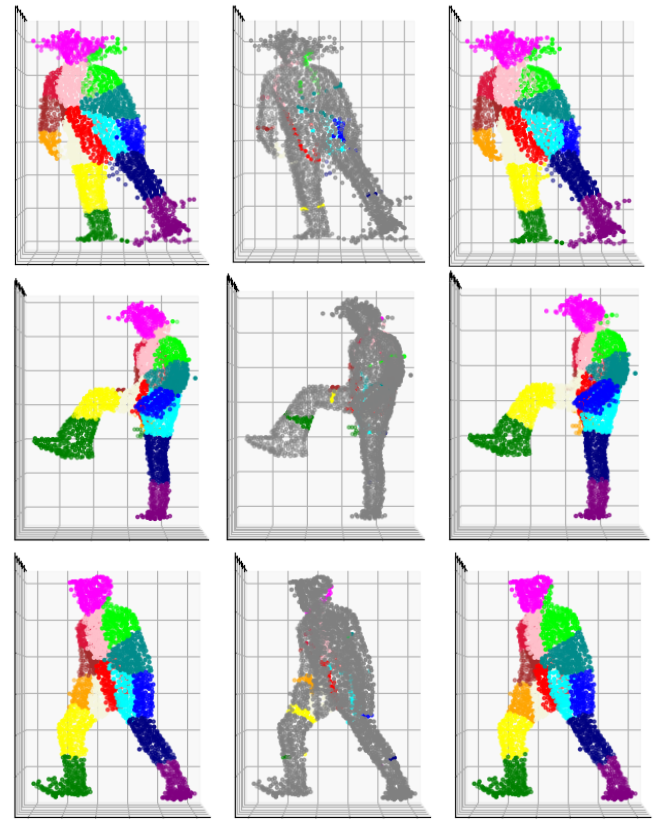

# Deep Learning-Based Human Body Segmentation on 3D Body Scans

The aim of my Bachelor's thesis was to segment unstructured point clouds representing real human bodies. In the context of point clouds, segmentation involves classifying each point into corresponding body segments. This repository contains most of the code used to achieve the results discussed in [my thesis](./Jakubovsky_bachelors_thesis.pdf). The segmentation was performed using deep learning networks, specifically:

* [PointNet](https://arxiv.org/abs/1612.00593)
* [PointNet++](https://arxiv.org/abs/1706.02413)
* [RanLA-Net](https://arxiv.org/abs/1911.11236)

These networks were retrained to work with human body point clouds. Due to the dataset's large size, the point clouds are not included in this repository. The results on the testing subset are summarised in the following table.

| Name of Network              | Number of Parameters | Accuracy |  mIoU  |
| :--------------------------: | :------------------: | :------: | :----: |
| PointNet                     |  3366518             | 95.36%   | 90.32% |
| PointNet++                   |  1388175             | 95.48%   | 90.5%  |
| RandLA-Net                   |  1300503             | 87.44%   | 76.86% |
| PointNet (data augmentation) |  3366518             | 92.42%   | 84.76% |

Visualisation of the quantitative results achieved by the best-performing model, PointNet++. The left image shows the prediction, the right image displays the ground truth, and the middle image highlights the discrepancies.
