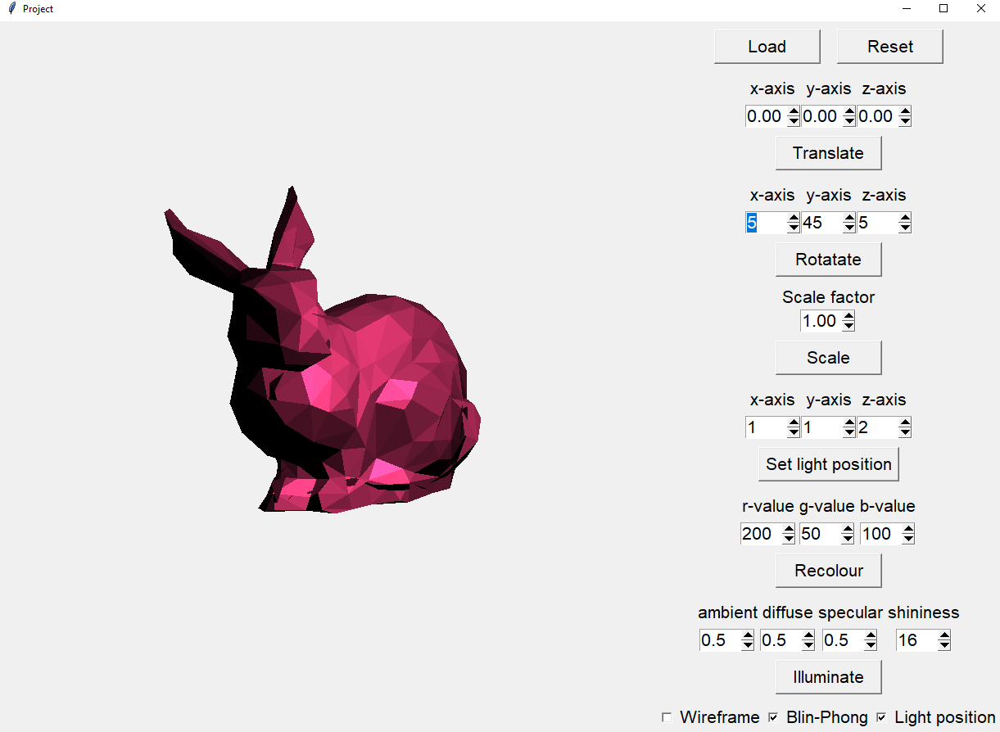

# Mesh Visualiser

A simple project implemented in Python for rendering meshes. The meshes are drawn onto canvas using orthographic projection. Loaded meshes can be translated, rotated and scaled. Each mesh can have it's material properties adjusted.  