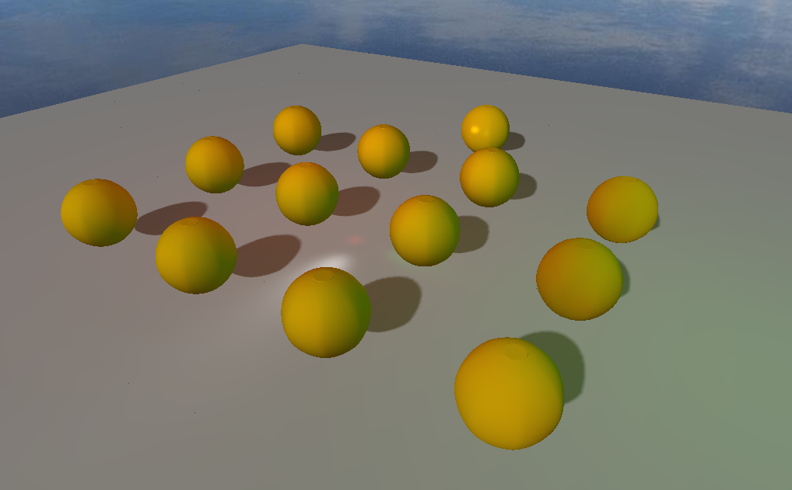
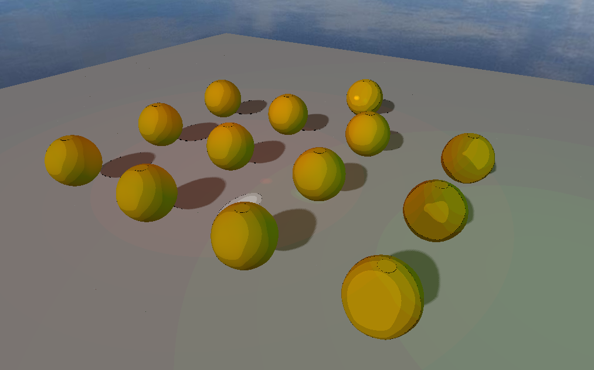
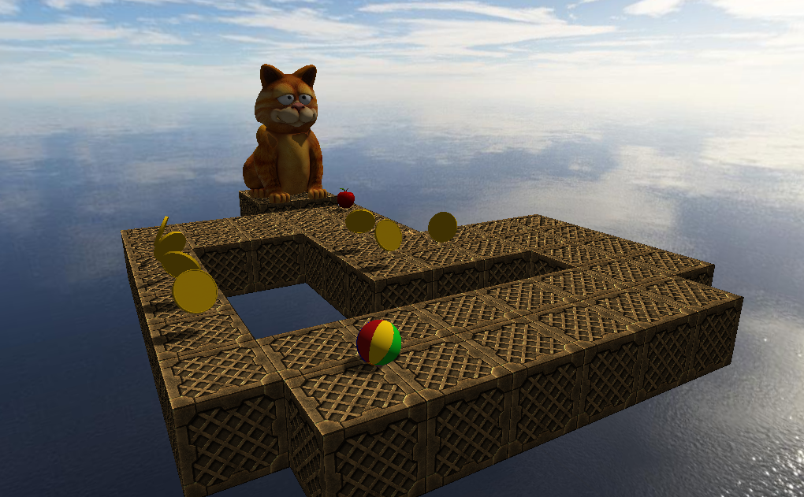
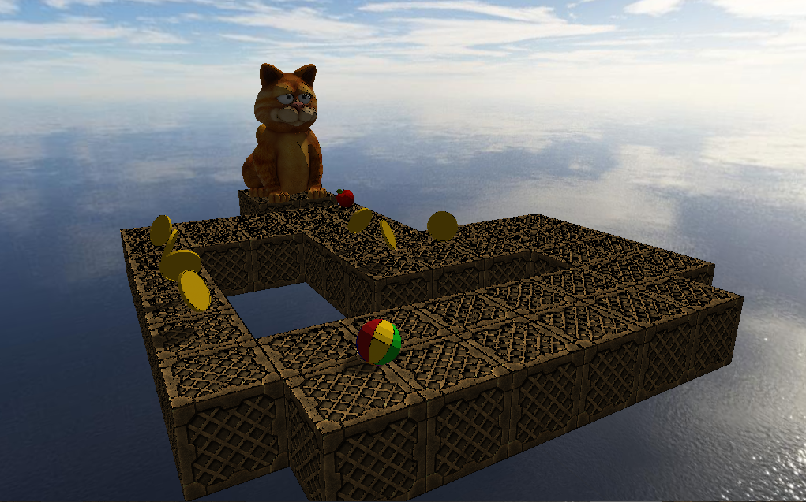

# Realtime Rendering Project

The aim of this project was to learn the basics of OpenGL and GLSL. The engine supports:

* external meshes
* moving objects
* moving camera
* point and directional light sources
* shadows
* Toon, cell shading, Oren-Nayar and Cook-Torrance per-pixel lighting

The project is split into two parts.

* scene: for visualising toon, cell shading, Oren-Nayar and Cook-Torrance per-pixel lighting while.

* game: a simple interactive scene for visualising moving objects.

## Dependencies

* PyOpenGL
* PyGame
* PyGLM
* PyWavefront

## Controls

* scene:
  * mouse: camera rotation
  * a, w, s, d: camera movement
  * t: toon shading on/off
  * l, p: lower, increase light intensity

* game:
  * arrow keys: ball tank controls
  * f: free camera mode
    * mouse: camera rotation
    * a, w, s, d: camera movement
  * t: toon shading on/off
