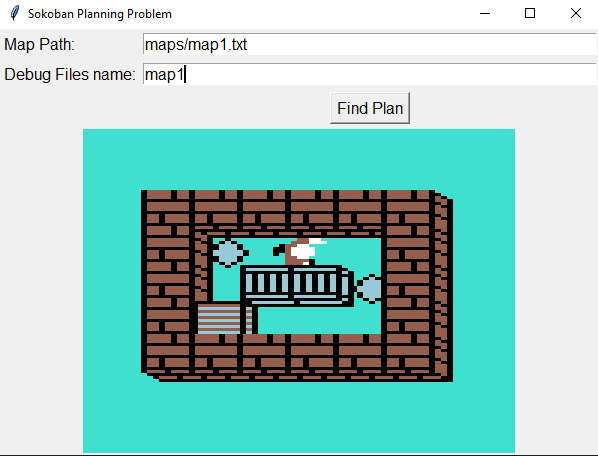
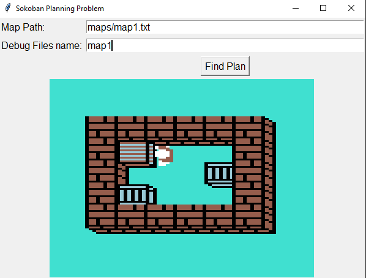

# Sokoban Solver

The aim of this project is to solve a planning problem, namely Sokoban puzzle. Sokoban is a puzzle game invented by Hiroyuki Imabayashi. Player is tasked by moving every single pushable block into designated area. Since player can only push boxes, performing wrong moved may lead to unsolvable game. Sprites were taken from: <https://www.spriters-resource.com/commodore_64/sokoban/sheet/96761/>

# Proposed solution

The problem is solved by SAT solver MiniSat. Firstly for some map a list of every possible action and state is generated in form CNF theory (set of logical statements (disjunctions)). In addition to actions and states the initial state and desired states are also included in theory. This theory is converted into MiniSat-friendly dimacs format. MiniSat then tries to find satisfiable model of proposed theory. If such model exists a sequence of actions can be extracted and visualised.