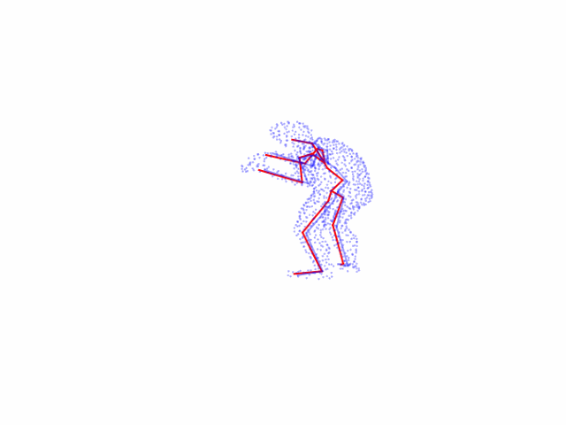
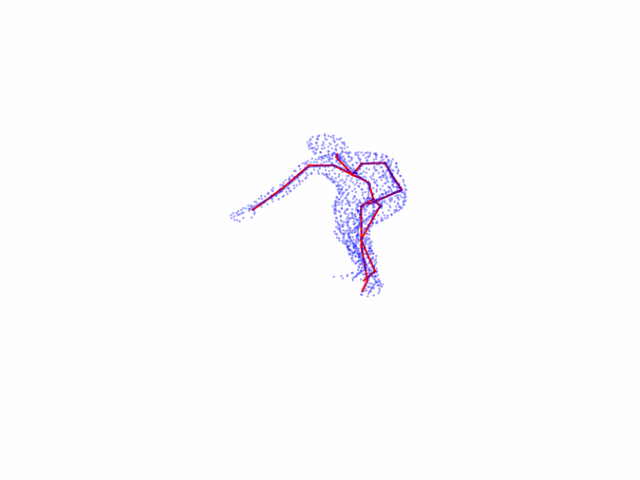

# Structured Point Clouds for Machine Learning Processing of Human Body Data

Many existing neural networks for 3D pose estimation predict poses from 2D RGB images. Since 2D images lack depth information, the goal of this thesis was to determine whether adding spatial information improves 3D pose estimation. One way to represent objects in space is through point clouds, which are essentially sets of points. These point sets (unstructured point clouds) can be organized into 2D grids (structured point clouds), essentially forming images where each channel corresponds to a spatial dimension. Unlike unstructured point clouds, structured point clouds can be processed by neural networks using 2D convolutions.

This project uses the following neural networks:

* [ResNet](https://arxiv.org/abs/1512.03385)
* [U-Net](https://arxiv.org/abs/1505.04597)
* [GoogLeNet](https://arxiv.org/pdf/1409.4842)
* [Inception Network](https://www.researchgate.net/publication/363292750_Inception_Network_for_Anthropometric_Body_Measurements_Estimation_from_Structured_Point_Clouds)
* [CenterNet](https://arxiv.org/abs/1904.07850)

This repository contains most of the code used to achieve the results reported in [my master's thesis](./Jakubovsky_masters_thesis.pdf). Initially, since the camera parameters were unknown (generated at random), most of the approaches in this work relied on direct regression for estimating 3D poses. However, due to subpar results, the dataset had to be regenerated with fixed camera parameters. With known camera parameters, the problem was reformulated into 2D joint detection and depth regression, following the approach outlined in the [Objects as Points](https://arxiv.org/abs/1904.07850) paper. Using these camera parameters, the predicted 2D pose and its depth, the 2D points could be reprojected back into 3D. As shown in the following table, this approach yielded the best results.

|                           Model                          | Average MPJPE [mm] |
| :------------------------------------------------------: | :----------------: |
|  GoogLeNet (Relative Pose, structured camera pt. clouds) |       217.767      |
|  GoogLeNet (Absolute Pose, structured camera pt. clouds) |       214.555      |
| Inception Net (root-aligned Pose, structured pt. clouds) |       214.555      |
|  ResNet-34 (Absolute Pose, structured camera pt. clouds) |       206.533      |
|      PointNet (root-aligned Pose, Random pt. clouds)     |       192.682      |
|    ResNet-18 (root-aligned Pose, structured pt. clouds)  |       186.314      |
|         PointNet (Absolute Pose, FPS pt. clouds)         |       169.715      |
|              DLA-34 (Absolute Pose, images)              |        62.394      |
| **DLA-34 (Absolute Pose, structured camera pt. clouds)** |      **44.939**    |

The following GIFs show the qualitative results of DLA-34 trained on structured point clouds. The red poses represent predictions, while the blue poses represent the ground truth.

