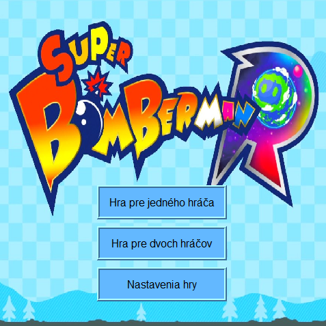
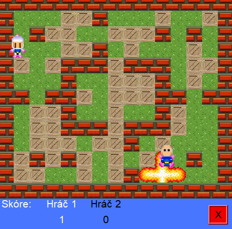
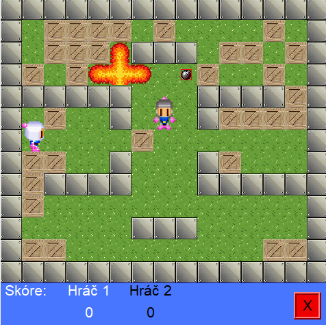

# 2-player Bomb Game

This project is a recreation of a well known bomb game. The game can be played with second player or a semi-suicidal ai. Sprites were taken from: <https://www.spriters-resource.com/game_boy_advance/bombermax2/sheet/9797/>

## Dependencies

* None

## Controls

* The aim of the game is to hurt the other player while avoiding bomb explosions.  
* Some boxes contain upgrades, which either increase the players bomb radius or increase the number of bombs the player can place.
* Controls and number of matches can be edited in the game settings.
