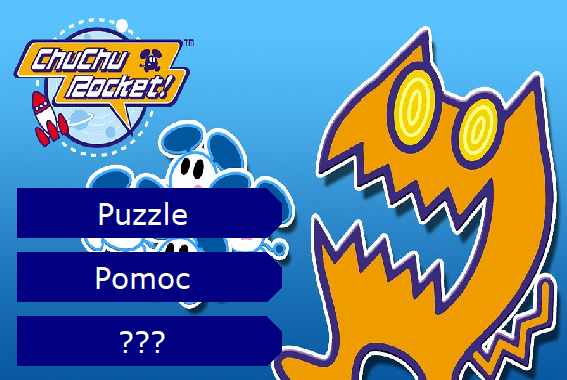
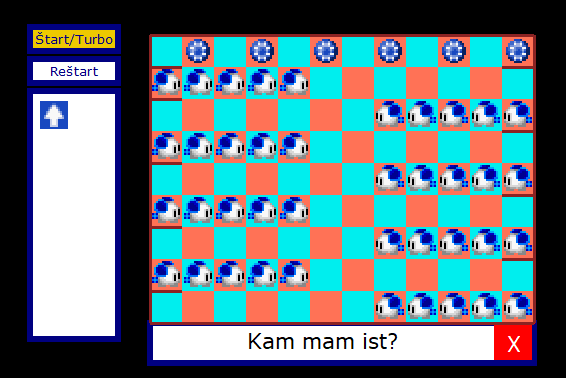
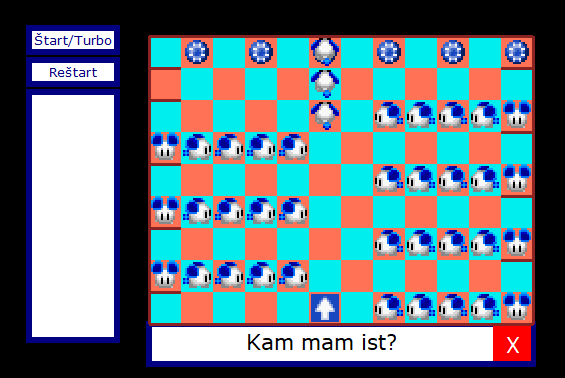

# Mice Puzzle Game

This project is a recreation of an existing game published in 1999. The original game was re-released for gba in 2005. Sprites used in this project are not mine and were ripped from the gba release: <https://www.spriters-resource.com/game_boy_advance/chuchu/>

## Dependencies

* PIL  

## Controls

* The aim of the game is to direct each mouse into a rocket while avoiding obstacles.
* The mice can be directed using directional tiles, which can be dragged onto board when the game is paused.
* Once the game is unpaused the directional tiles cannot be moved.
