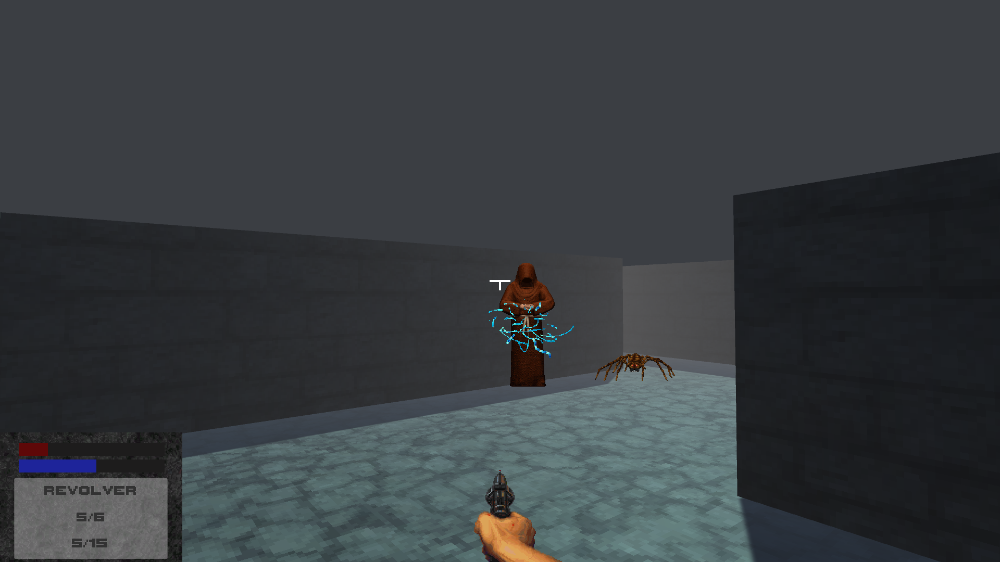

# Eldritch Dungeon Unity Project

This project is a Unity-based recreation of my Java project from last year. The game is a short, intense experience where you must fight your way through a dungeon inhabited by malevolent cultists and venomous spiders. The sprites used in this game are sourced from <https://www.spriters-resource.com/>.

## Goal

* The main objective is to escape the dungeon.
* You lose the game if your health or sanity drops to zero.

## Controls

* **Esc**: end game

* **Mouse movement:** move camera
* **Mouse scroll button:** change weapon
* **Left mouse button:** shoot revolver / cast spell

* **W:** move forward
* **S:** move backward
* **A:** move left
* **D:** move right

* **R:** reload
* **E:** pick up item

## Enemies

* **Cultists:** Extremely dangerous. They can cast magical orbs that harm the player. Avoid them if possible.
* **Spiders:** Weaker enemies that can bite and frighten the player.

## Items

Items can be picked up with the E key. Items cannot be picked up if doing so would not benefit the player.

* **Bandage:** Partially heals the player.
* **Large medikit:** Significantly increases the player's health.
* **Blue herb:** Calms the player's nerves, slightly restoring willpower.
* **Holy water:** Replenishes a large portion of willpower.
* **Ammunition:** Used to reload the revolver.

